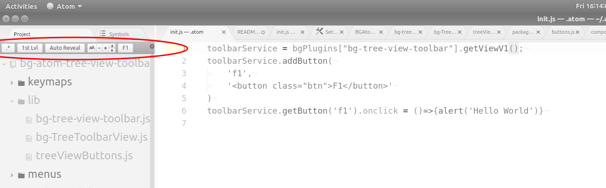

# bg-tree-view-toolbar package

This adds a toolbar to the top of the Atom tree-view. It comes with four buttons that can to turned on/off in the settings view. You can also add your own buttons by using the service in your own package or in your init.js.

This package also includes a style that makes the color of the selected tree item highlight change when the tree view has the focus so that you can more easily tell where the focus is in your workspace.



## Commands
This package provides the following commands. The commands that manipulate the included buttons are only active when the
toolbar is shown.

The shown state refers to when the toolbar is attached to the tree-view. It maybe 'shown' even if the tree view tab is not activate
and therefore neither the tree view nor the toolbar would be visible.

|Command                              | Scope      | Description
| ----------------------------------------------------|--------    |------------
| bg-tree-view-toolbar:show           | always<br/>on  | Cause the toolbar to appear on the tree view. <br/>(it is shown by default)
| bg-tree-view-toolbar:hide           | always<br/>on  | Cause the toolbar to be removed from the tree view.
| bg-tree-view:toggle-hidden          | when shown | Toggle the view hidden files button
| <nowrap>bg-tree-view:collapse-to-root-level</nowrap> | when shown | Execute the collapse to root button
| bg-tree-view:toggle-auto-track     | when shown | Toggle the auto track button

## Included Buttons

#### btnBarCfg (gear icon on upper right)
Opens the settings view to this window to configure and learn about the toolbar

#### btnHidden '.*'
Toggles the 'tree-view.hideIgnoredNames' configuration to hide and reveal hidden files in the tree view.

#### btnColAll '1st Lvl'
This is similar to collapses-all except it keeps the first level expanded. This is useful when your tree view has only one project
node. collapse-all results in only that one node being shown but that is not very interesting.   

#### btnTrack 'Auto Track'
This controls whether the tree selection changes to reflect the active editor pane as you focus different tabs. This relies on a
change I submitted in March 2020 to the tree-view project and I am releasing this package before I know if it will be accepted. If
the tree-view package you have does not have this change, this button will not be enabled even if its configuration is enabled.

#### fontGroup
This is a group of buttons that change the font size and line spacing of the items in the tree view. This has the effect of zooming
in and out to make the tradeoff of seeing more of your project and each item being easier to read.

The commands that these buttons execute are provided by the [bg-ui-font-sizer] package so these buttons will not be visible unless
you have installed that package.


## Adding Additional Buttons

A service is exposed so that you can control the toolbar and add/remove buttons. The service is available not only via the Atom service hub controlled by package.json but also via the bg.BGAtomPlugin.get('bg-atom-tree-view-toolbar').view... global entrypoint accessible in the console or init.js (See [bg-atom-utils](https://github.com/junga-com/bg-atom-utils) npm package). That allows easily using the service in the init.js file so that you can customize your personal editor without the overhead of making and maintaining an atom package.

The examples below illustrate a trivial button that alerts a message when clicked. To see examples of more functional buttons, look and the [lib/treeViewButtons.js](./lib/treeViewButtons.js) to see how the builtin buttons are created using the BGDOM component library.

## The Toolbar Service API

#### &lt;srv>.isShown()
return true if the toolbar is attached to the tree view (not whether you can see it at this time)

#### &lt;srv>.show()
attach the toolbar to the tree view

#### &lt;srv>.hide()
remove the toolbar from the tree view

#### &lt;srv>.getTreeView()
returns a reference to the tree-view object

#### &lt;srv>.addButton(_btnName_, _button_)
add a new button with a unique name
* _&lt;btnNam>_ : names follow the rules of JS variable names
* _&lt;button>_  : the button object follows the REDOM style of components. It can be specified as one of these...
  * html string. It should have one top level node. A DOM Node will be created using outerHTML (conceptually)
  * a DOM Node. create it any way you like
  * any JS object that has a .el property that is a DOM Node. This style is compatible with REDOM and bg-atom-redom npm pacakges.

#### &lt;srv>.getButton(_btnName_)
return the button. This might be a DOM node or a JS object that has a .el prop which is a DOM node.
* _&lt;btnName>_ : names follow the rules of JS variable names
* _&lt;return value>_: returns what was passed into addButton except that html strings will be returned as their realized DOM Node.

#### &lt;srv>.removeButton(_btnName_)
remove the named button
* _&lt;btnNam>_ : names follow the rules of JS variable names

#### &lt;srv>.isButtonEnabled(_btnName_)
buttons that are added to the toolbar can be turned on and off. This is useful for user  preferences and dynamically turning off some buttons to make room for others based on what the user is doing.
* _&lt;btnNam>_ : names follow the rules of JS variable names

#### &lt;srv>.enableButton(btnName, onoff)
turn the named button on(true) or off(false)
* _&lt;btnNam>_ : names follow the rules of JS variable names
* _&lt;onoff>_ : true means the button will be on/enabled, false == off/disabled

### init.js Example
---
You can try this right now by copying this code into your inti.js
* open your init.js (edit menu -> 'Init Script...'), copy the text below into the file, then restart Atom (window:reload command)
* note atom might assume you want a .coffee file. You can safe as and rename it to .js if you want

In init.js ...
```javascript
toolbar = bg.BGAtomPlugin.get("bg-tree-view-toolbar").getViewV1();
toolbar.addButton(
    'f1',
    '<button class="btn">F1</button>'
)
toolbar.getButton('f1').onclick = ()=>{
    const tv = toolbar.getTreeView();
    atom.commands.dispatch(tv, 'tree-view:collapse-all');
}
```

### Dev Console Example ...
---
Open the dev console (cntr-shift-i or window:toggle-dev-tools command) and you can experiment with the toolbar API in real time.  After you type `bg.BGAtomPlugin.get("bg-tree-view-toolbar").getViewV1().` autocomplete will show you what is available.

Create an f1 button...
```javascript
toolbar = bg.BGAtomPlugin.get("bg-tree-view-toolbar");
toolbar.addButton('f1', '<button class="btn">F1</button>')
toolbar.getButton('f1').onclick = ()=>{alert('Hello World')}
```
Then to remove the f1 button...
```javascript
toolbar.removeButton('f1')

```


### Atom Service Example:
---

In your package's package.json...
```json
...
"consumedServices": {
	"bg-tree-view-toolbar": {
	"versions": {
	  "^1.0.0": "consumeTreeViewToolbar"
	}
  }
},
...
```
In your package's JS file referenced in package.json's "main" property...
```javascript
...
    consumeTreeViewToolbar(toolbarService) {
		toolbarService.addButton(
			'f1',
			'<button class="btn">F1</button>'
		)
		toolbarService.getButton('f1').onclick = ()=>{alert('Hello World')}
	}
...
```

## Customizing the Toolbar Style

You can change a lot about the toolbar by styling it differently in your styles.less file. The default styling is in the ./styles/bg-tree-view-toolbar.less
file in this project's pacakge folder (typically that will be ~/.atom/pacakges/bg-tree-view-toolbar). You can copy all or part of that file to your ~/.atom/styles.less
file to make changes.

The general structure is this...
```less
div.bg-tree-view-toolbar {
	// attributes for the bar container

    .btn {
        // default attributes for all buttons inside the (The .btn class is used by atom for all standard button styling)
    }

	.<buttonName> {
		// styling for a specific button. See the Included Buttons section for the names.
	}
```

#### Hacking Tip

If you want to play around with this package in ways that are not exposed through the commands, open devtools console (window:toggle-dev-tools) and explore the bg... global variable. Start typing the `bg...` to see what mechanisms are available to explore.

  * bg.BGAtomPlugins.logStatus() : list the packages that use the BGPlugin style
  * bg.BGAtomPlugins.get(pkgName) : get a reference to a package plugin instance to explore
  * bg.PolyfillObjectMixin.logStatus() : list the Atom polyfills that are installed (these add features to Atom API)

When you complete a command that returns an object, it will be logged in the console where you can expand it to explore its current state. You can autocomplete further to navigate to the sub-objects and if you assign an object to a variable in the console, you can invoke its methods and see what they do.
```javascript
> pkg = bg.BGAtomPlugin.get('<packageName>')
> pkg.addCommand(...)
```
